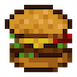
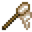
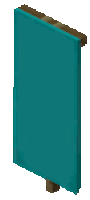
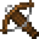

# Item Behaviours

Item behaviours define specific functionalities associated with items, blocks, and decorations. 

All behaviours are optional, and some are mutually exclusive (e.g., trap, shoot, and instrument).

Example with some behaviours set:
<details>
<summary>Click to expand</summary>

~~~admonish example
```json
{
  "id": "mynamespace:multi_example",
  "vanillaItem": "minecraft:paper",
  "itemResource": {
    "models": {
      "default": "mynamespace:custom/misc/clown_horn",
      "trapped": "mynamespace:custom/misc/clown_horn_trapped"
    }
  },
  "behaviour": {
    "instrument": {
      "sound": "mynamespace:misc.honk",
      "range": 64,
      "useDuration": 60
    },
    "shoot": {
      "consumes": false,
      "baseDamage": 2.0,
      "speed": 1.0,
      "projectile": "minecraft:iron_axe",
      "sound": "mynamespace:misc.shoot"
    },
    "armor": {
      "slot": "head",
      "texture": "mynamespace:texture_name"
    },
    "trap": {
      "types": ["minecraft:villager", "minecraft:zombie", "minecraft:skeleton"],
      "requiredEffects": ["minecraft:glowing"],
      "chance": 75,
      "useDuration": 0
    },
    "fuel": {
      "value": 10
    },
    "food": {
      "hunger": 2,
      "saturation": 1.0,
      "canAlwaysEat": true,
      "fastfood": true
    },
    "cosmetic": {
      "slot": "head",
      "model": "mynamespace:custom/models/clown_backpack_animated",
      "autoplay": "idle",
      "scale": [1.5, 1.5, 1.5],
      "translation": [0.0, 0.5, 0.0]
    },
    "execute": {
      "consumes": true,
      "command": "/summon minecraft:creeper ~ ~ ~ {powered:1b}",
      "sound": "minecraft:block.anvil.place"
    }
  }
}
```
~~~
</details>

---

## `armor` behaviour


Defines armour item behaviours, using the Fancypants shader via Polymer.

~~~admonish tip
As of filament 0.7 it is possible to use armor trims to render custom armor, to enable this, set the `trim` flag to `true`.
~~~

**For Shader-Based Armor**:

- The textures for the shader version of armor should be located in `assets/minecraft/textures/models/armor/`.
- For a `texture` field value of `mynamespace:amethyst`, the textures should be named `amethyst_layer_1.png` and `amethyst_layer_2.png`.
- It's required to use a leather armor item for your `vanillaItem` for the shader to work.

**For Trim-Based Armor**:

- When using Armor Trims for the armor, the textures need to be located in `assets/minecraft/textures/trims/models/armor/`.
- For a `texture` field value of `mynamespace:amethyst`, the textures should be named `amethyst.png` and `amethyst_leggings.png`.
- It's required to use an armor item for your `vanillaItem`. Any armor item should work.
- Depending on the `vanillaItem` of your custom item, you might be able to see parts of the original armors texture, to mitigate this, you will have to enable the `trimArmorReplaceChainmail` option in the mods configs.
- Enabling `trimArmorReplaceChainmail` will prevent all chainmail armor pieces unable to receive or display armor trims. The Smithing Table will also reject chainmail armor with this option enabled.

~~~admonish info "Fields"
- `slot`: The equipment slot for the armour piece (e.g., head, chest, legs, or feet).
- `texture`: The resource location of the texture associated with the armour. Example: `mynamespace:amethyst`
- `trim`: Flag whether to use trim-based armor instead of shaders
~~~

<br>
<br>

---

## `compostable` behaviour


Makes the item usable in composters.

~~~admonish info "Fields"
- `chance`: Chance of raising the composter level by 1 between 0 and 100
- `villagerInteraction`: Allows farmer villagers to compost the item. Defaults to `true`
~~~

<br>

---

## `cosmetic` behaviour


Defines cosmetic item behaviour for either the head or chestplate slot, supporting both Blockbench models for chestplates and simple item models for either slot.

~~~admonish info "Fields"
- `slot`: The equipment slot for the cosmetic (head or chest).
- `model`: Optional, the resource location of the animated blockbench or animated-java model for the cosmetic.
- `autoplay`: Optional, the name of the animation to autoplay, which should be loopable.
- `scale`: Scale of the chest cosmetic, defaulting to (1, 1, 1).
- `translation`: Translation of the chest cosmetic, defaulting to (0, 0, 0).
~~~

<br>

---

## `execute` behaviour

Executes a command on item use with the player as source, located at the player.

~~~admonish info "Fields"
- `consumes`: Flag whether the item is consumed after running the command(s). Defaults to `false`
- `command`: The command string to execute. Empty by default
- `commands`: List of commands to execute. Empty by default
- `sound`: Optional sound effect to play during execution. Empty by default
~~~

<br>

---

## `food` behaviour


Defines food item behaviour for edible items.

~~~admonish info "Fields"
- `hunger`: The amount of hunger restored when consumed. Defaults to `1`
- `saturation`: The saturation modifier provided by the food. Defaults to `0.6`
- `canAlwaysEat`: Indicates whether the item can be eaten when the hunger bar is full. Defaults to `false` 
- `fastfood`: Boolean indicating whether the food item is considered fast food (eats faster than normal). Defaults to `false`
~~~

<br>

---

## `villager_food` behaviour


Makes the item edible for villagers (for villager breeding).

~~~admonish info "Fields"
  - `value`: The amount of "breeding power" the item has (1 = normal food item, 4 = bread). Defaults to `1`
~~~

<br>
<br>

---

## `fuel` behaviour

Defines fuel behaviour for items, specifying their value used in furnaces and similar item-burning blocks.

~~~admonish info "Fields"
- `value`: The value associated with the fuel, determining burn duration. Defaults to `10`
~~~

<br>

---

## `hoe` behaviour

Gives the item the ability to till farmland, like vanilla hoes do, using 1 durability.

~~~admonish info "Fields"
- `sound`: Sound to play. Default to the vanilla hoe tilling sound `minecraft:item.hoe.till`
~~~

---

## `shovel` behaviour

Gives the item the ability to change blocks to path blocks, like vanilla shovels do, using 1 durability.

~~~admonish info "Fields"
- `sound`: Sound to play. Default to the vanilla shovel sound
~~~

---

## `shears` behaviour

Gives the item the ability to shears blocks & plants, like vanilla shears do, using 1 durability.

~~~admonish info "Fields"
- `sound`: Sound to play. Default to the vanilla plant shearing sound
~~~

---

## `instrument` behaviour


Defines instrument behaviour for items, similar to goat horns.

~~~admonish info "Fields"
- `sound`: The sound associated with the instrument. Empty by default
- `range`: The range of the instrument. Defaults to `0`
- `useDuration`: Delay in ticks for using the instrument. Defaults to `0`
~~~

<br>
<br>

---

## `stripper` behaviour

Gives the item the ability to strip Logs/scrape copper blocks, like an axe. Uses 1 durability.


### Fields:
- `sound`: Sound to play. Default to the vanilla axe strip sound

---

## `trap` behaviour


Defines trap behaviour for items capable of trapping specific entity types.

~~~admonish info "Fields"
- `types`: List of allowed entity types to trap. Example: `["minecraft:silverfish", "minecraft:spider"]`
- `requiredEffects`: List of required effects for the trap. Example: `["minecraft:weakness"]`
- `chance`: Chance of the trap triggering (`0`-`100`). Defaults to `50`
- `useDuration`: Use cooldown for the trap item. Defaults to `0`
~~~

<br>
<br>

---

## `banner_pattern` behaviour


Allows you to assign a banner pattern to an item for use in Looms.

See the `mynamespace:bannertestitem` item config in the example datapack in the GitHub repo.

~~~admonish info "Fields"
- `id`: The id of your banner_pattern in your datapack. Empty by default
~~~


---

## `bow` behaviour


Vanilla-like bow behaviour. Lets you specify which item can be shot, but anything that is not an arrow or firework rocket will render as normal arrow.
Allows to specify a power multiplier for shooting power. Supports firework rockets.

**Make sure to use `minecraft:bow` as `vanillaItem` in order for the item model overrides to work properly!**

~~~admonish info "Fields"
- `powerMultiplier`: The power multiplier. Defaults to `3`
- `supportedProjectiles`: List of supported items in the inventory for use with the bow. Defaults to `["minecraft:arrow", "minecraft:spectral_arrow"]`
- `supportedHeldProjectiles`: List of supported items for use when in main/offhand. Defaults to `["minecraft:arrow", "minecraft:spectral_arrow", "minecraft:firework_rocket"]`
- `shootSound`: The sound when shooting a projectile. Default to `minecraft:entity.arrow.shoot`
~~~

<br>
This behaviour can automatically generate the item model predicate overrides for bows (item assets in `items` in 1.21.4).

In order to automatically generate an item model for bows, you have to provide models for `default`, `pulling_0`, `pulling_1` and `pulling_2` in the `itemResource` field:
~~~admonish example
```json5
{
  "itemResource":  {
    "models": {
      "default": "minecraft:custom/bow/custombow",
      "pulling_0": "minecraft:custom/bow/custombow_pulling_0",
      "pulling_1": "minecraft:custom/bow/custombow_pulling_1",
      "pulling_2": "minecraft:custom/bow/custombow_pulling_2"
    }
  }
}
```
~~~

Alternatively, you can use the `itemModel` field to provide your own item asset model

---

## `crossbow` behaviour


Vanilla-like crossbow behaviour. Lets you specify which item can be shot, but anything that is not an arrow or firework rocket will render as normal arrow.
Allows to specify a power multiplier for shooting power.

~~~admonish warning
**Make sure to use `minecraft:crossbow` as `vanillaItem` in order for the item model overrides to work properly!**
~~~

This behaviour can automatically generate the item model predicate overrides for crossbows (item assets in `items` in 1.21.4).

In order to automatically generate an item model for crossbows, you have to provide models for `default`, `pulling_0`, `pulling_1`, `pulling_2`, `arrow` and `rocket` in the `itemResource` field:
~~~admonish example
```json5
{
  "itemResource": {
    "models": {
      "default": "minecraft:custom/crossbow/crossy1", // model without projectile
      "pulling_0": "minecraft:custom/crossbow/crossy1_pulling_0",
      "pulling_1": "minecraft:custom/crossbow/crossy1_pulling_1",
      "pulling_2": "minecraft:custom/crossbow/crossy1_pulling_2",
      "arrow": "minecraft:custom/crossbow/crossy1_arrow", // model with projectile
      "rocket": "minecraft:custom/crossbow/crossy1_rocket" // model with projectile
    }
  }
}
```
~~~

Alternatively, you can use the `itemModel` field to provide your own item asset model.

~~~admonish info "Fields"
- `powerMultiplier`: The power multiplier. Defaults to `1`
- `supportedProjectiles`: List of supported items in the inventory for use with the crossbow. Defaults to `["minecraft:arrow", "minecraft:spectral_arrow"]`
- `supportedHeldProjectiles`: List of supported items for use when in main/offhand. Defaults to `["minecraft:arrow", "minecraft:spectral_arrow", "minecraft:firework_rocket"]`
- `shootSound`: The sound when shooting a projectile. Default to `minecraft:item.crossbow.shoot`
- `loadingStartSound`: Projectile loading start sound. Default to `minecraft:item.crossbow.loading_start`
- `loadingMiddleSound`: Projectile loading middle sound. Default to `minecraft:item.crossbow.loading_middle`
- `loadingEndSound`: Projectile loading end sound. Default to `minecraft:item.crossbow.loading_end`
~~~

<br>
<br>

---

## `shoot` behaviour

Defines behaviour for items capable of shooting custom projectiles or being shot themselves.

~~~admonish warning
This behaviour is deprecated. Use `bow`, `crossbow` or `trident`
~~~

~~~admonish info "Fields"
- `consumes`: Indicates whether shooting consumes the item. Defaults to `false`
- `baseDamage`: The base damage of the projectile. Defaults to `2.0`
- `speed`: The speed at which the projectile is fired. Defaults to `1.0`
- `projectile`: The identifier for the projectile item. Empty by default
- `sound`: Optional sound effect to play when shooting. Empty by default
- `translation`: Translation offset for the projectile. Defaults to `[0 0 0]`
- `rotation`: Rotation for the projectile. Defaults to `[0 90 0]`
- `scale`: Scale for the projectile. Defaults to `0.6`
~~~

---

## `shield` behaviour

Makes the item usable as shield.

This behaviour can automatically generate the item model predicate overrides for shields (item assets in `items` in 1.21.4).

In order to automatically generate an item model for shields, you have to provide models for `default` and `blocking` in the `itemResource` field:
~~~admonish example
```json
{
  "itemResource": {
    "models": {
      "default": "minecraft:custom/shield/shield1",
      "blocking": "minecraft:custom/shield/shield1_blocking"
    }
  }
}
```
~~~

Alternatively, you can use the `itemModel` field to provide your own item asset model

---

## `fishing_rod` behaviour

Makes the item behave like a fishing rod!

This behaviour can automatically generate the item model predicate overrides for fishing rods (item assets in `items` in 1.21.4).

In order to automatically generate an item model for fishing rods, you have to provide models for `default` and `cast` in the `itemResource` field:
~~~admonish example
```json
{
  "itemResource": {
    "models": {
      "default": "minecraft:custom/rod/fire_rod",
      "cast": "minecraft:custom/rod/fire_rod_cast"
    }
  }
}
```
~~~

Alternatively, you can use the `itemModel` field to provide your own item asset model

---

## `trident` behaviour

~~~admonish warning
This behaviour is experimental and only supported in minecraft 1.21.4 or later
~~~

Makes the item behave like a trident!

This behaviour can automatically generate the item model predicate overrides for tridents.

In order to automatically generate an item model for tridents, you will have to provide models for `default` and `cast` in the `itemResource` field:
~~~admonish example
```json
{
  "itemResource": {
    "models": {
      "default": "minecraft:custom/trident/nether_trident",
      "throwing": "minecraft:custom/trident/nether_trident_throwing"
    }
  }
}
```
~~~

Alternatively, you can use the `itemModel` field to provide your own item asset model

---

## `trident` behaviour

Makes the item behave like a mace!

There are no options.

~~~admonish example
```json
{
  "behaviour": {
    "mace": {}
  }
}
```
~~~

---

## `enchantable` behaviour

Backport of the `minecraft:enchantable` component introduced in 1.21.2, only available for 1.21.1.

~~~admonish info "Fields"
- `value`: Enchantability value. Defaults to `1`
~~~

~~~admonish example
```json
{
  "behaviour": {
    "enchantable": {
      "value": 1
    }
  }
}
```
~~~

---

## `repairable` behaviour

Backport of the `minecraft:repairable` component introduced in 1.21.2, only available for 1.21.1.

~~~admonish info "Fields"
- `items`: List of items and or item-tags
~~~

~~~admonish example
```json
{
  "behaviour": {
    "repairable": {
      "items": ["minecraft:honeycomb", "#minecraft:candles"]
    }
  }
}
```
~~~